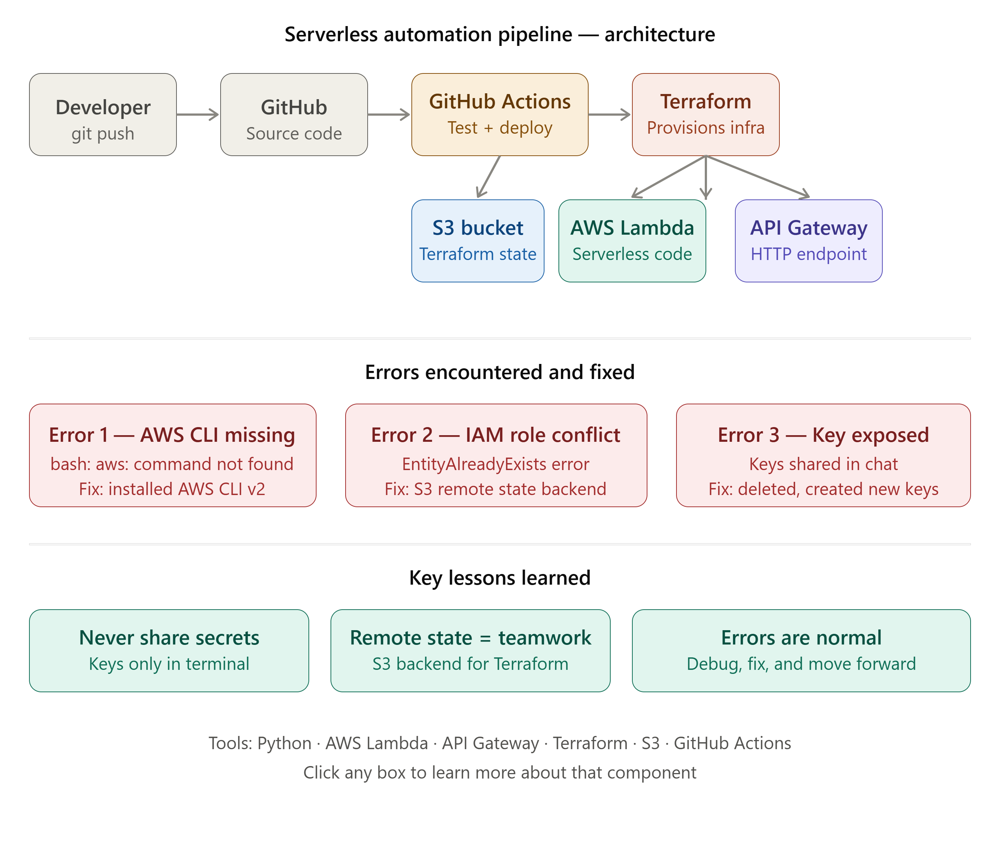

# Serverless Automation Pipeline

## Overview
A complete serverless automation pipeline built on AWS using Lambda,
API Gateway, and Terraform with automated CI/CD via GitHub Actions.

## Tech Stack
- **Serverless:** AWS Lambda (Python 3.11)
- **API:** AWS API Gateway (HTTP API)
- **Infrastructure as Code:** Terraform
- **State Management:** AWS S3 Backend
- **CI/CD:** GitHub Actions
- **Cloud:** AWS (us-east-1)

## Architecture Diagram

## Pipeline Flow
Developer → GitHub → GitHub Actions → Terraform → AWS Lambda + API Gateway
↓
S3 (Terraform State)
## How It Works
1. Developer pushes code to GitHub
2. GitHub Actions runs tests automatically
3. Terraform provisions AWS infrastructure
4. Lambda function goes live via API Gateway
5. API is accessible globally with zero server management

## API Endpoints
- `POST /tasks` — Submit a task to the serverless function

## Project Structure
serverless-automation-pipeline/
├── lambda/
│   ├── handler.py
│   └── test_handler.py
├── terraform/
│   ├── main.tf
│   ├── variables.tf
│   └── outputs.tf
└── .github/
└── workflows/
└── deploy.yml
## Errors Encountered and Fixed

### Error 1 — AWS CLI missing
- **Error:** `bash: aws: command not found`
- **Cause:** AWS CLI was not installed in GitHub Codespaces
- **Fix:** Installed AWS CLI v2 manually using curl and unzip

### Error 2 — IAM Role conflict
- **Error:** `EntityAlreadyExists: Role with name serverless_lambda_role already exists`
- **Cause:** Terraform was run locally first, then GitHub Actions tried
to create the same resources again without knowing about existing state
- **Fix:** Added S3 remote backend to store Terraform state so GitHub
Actions could read existing infrastructure

## Key Lessons Learned
- Always use remote Terraform state (S3 backend) when using CI/CD pipelines
- Errors are a normal part of DevOps — debug, fix, and move forward
- Store all credentials in GitHub Secrets, never hardcode them
